# Custom Domains — Technical Architecture

**Product:** Ownvite  
**Stack:** Next.js 15 App Router  
**Status:** MVP design note (implementation not yet wired)

This document describes how Ownvite serves event invitations across three URL shapes — path-based, platform subdomain, and bring-your-own custom domain — and how middleware, DNS, and data resolution fit together.

---

## 1. URL Model

Guests can reach the same event page through three equivalent entry points. All three resolve to a single canonical event record and render the same `/e/[slug]` invite UI.

| Access pattern | Example | Who uses it | Notes |
|--------------|---------|-------------|-------|
| **Path on apex** | `https://ownvite.app/e/h-birthday-2026` | Free tier default, share links, admin preview | Always works; no DNS setup |
| **Platform subdomain** | `https://h-birthday-2026.ownvite.app` | Free/Pro branded link | Wildcard DNS on `*.ownvite.app` |
| **Custom domain (BYOD)** | `https://party.customer.com` | Pro Event tier | Customer CNAMEs to Ownvite |

### Canonical vs. served URL

- **Canonical URL** (for SEO, Open Graph, sitemap): the host the host chose at publish time — usually the custom domain if configured, otherwise `{slug}.ownvite.app`.
- **Served URL**: whatever the guest typed. Middleware normalizes all valid hosts to the same internal route; we do **not** 302 guests away from a valid host to another (avoids redirect loops and preserves share links).

```
Guest request                    Middleware resolves              App renders
─────────────────────────────────────────────────────────────────────────────
ownvite.app/e/{slug}      →     slug lookup               →     /e/{slug}
{slug}.ownvite.app      →     subdomain → eventId       →     rewrite → /e/{slug}
party.customer.com       →     customDomain → eventId     →     rewrite → /e/{slug}
```

### Slug rules (MVP)

- Lowercase alphanumeric plus hyphens: `^[a-z0-9]+(?:-[a-z0-9]+)*$`
- Unique across all events
- Reserved slugs: `www`, `api`, `admin`, `app`, `e`, `cname`, `_acme-challenge`, etc.

---

## 2. Middleware: Host Parsing → Event Resolution

Middleware runs on the Edge for every document request. Its job is to read the `Host` header, classify the request, resolve an `eventId`, and either pass through or rewrite to `/e/{slug}`.

### Request classification

```mermaid
flowchart TD
  A[Incoming request] --> B{Host header present?}
  B -->|no| X[400 Bad Request]
  B -->|yes| C[Normalize host: lowercase, strip port]
  C --> D{Platform host?}
  D -->|ownvite.app / www| E{Path starts with /e/?}
  E -->|yes| F[Pass through to /e/slug]
  E -->|no| G[Marketing / app routes]
  D -->|*.ownvite.app| H[Extract subdomain label]
  H --> I{Reserved label?}
  I -->|yes| J[404 or redirect to apex]
  I -->|no| K[Lookup by slug = subdomain]
  D -->|other| L[Lookup by customDomain = host]
  K --> M{Event found & published?}
  L --> M
  M -->|yes| N["rewrite → /e/{slug}"]
  M -->|no| O[404 invite-not-found]
```



### Host normalization

```ts
function normalizeHost(raw: string | null): string | null {
  if (!raw) return null;
  const withoutPort = raw.split(":")[0].toLowerCase();
  return withoutPort.startsWith("www.") ? withoutPort.slice(4) : withoutPort;
}
```

### Platform host constants

| Constant | Value | Purpose |
|----------|-------|---------|
| `APEX_HOST` | `ownvite.app` | Marketing, path-based invites |
| `SUBDOMAIN_SUFFIX` | `.ownvite.app` | Wildcard tenant subdomains |
| `CNAME_TARGET` | `cname.ownvite.app` | Customer DNS instruction target |

### Resolution order

1. If host is `ownvite.app` (or `www.ownvite.app` → treat as apex): no rewrite for `/e/*`; other paths unchanged.
2. If host ends with `.ownvite.app` and is not apex: treat leftmost label as `slug` → `getEventBySlug(slug)`.
3. Otherwise: treat full host as `customDomain` → `getEventByCustomDomain(host)`.
4. On match: `NextResponse.rewrite(new URL(`/e/${event.slug}`, request.url))`.
5. On miss: `NextResponse.rewrite(new URL('/invite-not-found', request.url))` or plain 404.

### Matcher config

Exclude static assets, Next internals, and API routes that do not need host logic:

```ts
export const config = {
  matcher: [
    "/((?!_next/static|_next/image|favicon.ico|api/health|.*\\.(?:svg|png|jpg|jpeg|gif|webp)$).*)",
  ],
};
```

### Data access in middleware (MVP vs. production)

| Phase | Lookup source | Notes |
|-------|---------------|-------|
| **MVP** | In-memory map built from JSON seed at cold start | Fast to ship; redeploy to update domains |
| **Later** | Edge Config / KV / Postgres read replica | Sub-minute propagation; admin UI writes |

Middleware must stay **read-only** and **fast** — no DNS verification or SSL provisioning in the hot path.

---

## 3. DNS, Verification, and SSL

### Customer-facing setup (BYOD)

The host adds two DNS records at their registrar or DNS provider:

| Type | Name | Value | Purpose |
|------|------|-------|---------|
| **CNAME** | `party` (or `@` via ALIAS/ANAME — see edge cases) | `cname.ownvite.app` | Route traffic to Ownvite |
| **TXT** | `_ownvite-verify.party` | `ownvite-verify={eventId}` | Prove domain ownership before we accept the mapping |

**Verification flow (post-MVP, design now):**

1. Host enters `party.customer.com` in Ownvite settings → status `pending_dns`.
2. Ownvite stores desired TXT token keyed to `eventId`.
3. Background job (or on-demand API) resolves TXT; on match → status `verified`.
4. Only `verified` domains are added to the edge routing table / Cloudflare custom hostname list.
5. SSL certificate issued automatically once hostname is active.

### Ownvite infrastructure DNS

| Record | Configuration |
|--------|---------------|
| `ownvite.app` | A/AAAA to hosting (Vercel or origin) |
| `*.ownvite.app` | Wildcard CNAME to hosting |
| `cname.ownvite.app` | CNAME to hosting (stable target for customer CNAMEs) |

### Cloudflare for SaaS (recommended for production SSL)

Use [Cloudflare for SaaS](https://developers.cloudflare.com/cloudflare-for-platforms/cloudflare-for-saas/) (or equivalent: Vercel Domains API, AWS CloudFront + ACM) to terminate TLS for arbitrary customer hostnames:

1. Ownvite zone: `ownvite.app` on Cloudflare.
2. Fallback origin points to Next.js deployment.
3. Each verified `party.customer.com` registered as a **Custom Hostname**.
4. Cloudflare issues Universal SSL or DCV cert per hostname.
5. Optional: Cloudflare validates TXT on behalf of Ownvite via custom metadata.

**MVP shortcut:** Run only `*.ownvite.app` + apex on Vercel; defer BYOD SSL to a staging flag or manual hostname allowlist in the dashboard.

---

## 4. MVP Stub: In-Memory / JSON Domain Map

For local development and the first deploy, avoid a database. Load event records from JSON (e.g. `data/birthday-demo.json`) and build two indexes at module init.

### File layout (proposed)

```
data/
  events/
    h-birthday-2026.json
src/
  lib/
    events/
      types.ts          # EventRecord (see contract below)
      store.ts          # load JSON, build maps
      resolve.ts        # getEventBySlug, getEventByCustomDomain
  middleware.ts         # host parse → rewrite
  app/
    e/[slug]/page.tsx   # single invite renderer
```

### Store shape

```ts
// Built once at import time (MVP)
const bySlug = new Map<string, EventRecord>();
const byCustomDomain = new Map<string, EventRecord>();

for (const event of loadEventsFromDisk()) {
  bySlug.set(event.slug, event);
  if (event.customDomain) {
    byCustomDomain.set(normalizeHost(event.customDomain)!, event);
  }
}
```

### Middleware rewrite (MVP pseudocode)

```ts
import { NextRequest, NextResponse } from "next/server";
import { resolveEventFromHost } from "@/lib/events/resolve";

export function middleware(request: NextRequest) {
  const host = normalizeHost(request.headers.get("host"));
  if (!host || !isAllowedHost(host)) {
    return new NextResponse("Invalid host", { status: 400 });
  }

  // Apex: path-based routing — no rewrite for /e/*
  if (host === "ownvite.app") {
    return NextResponse.next();
  }

  const event = resolveEventFromHost(host);
  if (!event?.published) {
    return NextResponse.rewrite(new URL("/invite-not-found", request.url));
  }

  const url = request.nextUrl.clone();
  url.pathname = `/e/${event.slug}`;
  return NextResponse.rewrite(url);
}
```

### Local dev hosts

Add to `/etc/hosts` (or use a `.local` tool):

```
127.0.0.1  ownvite.app
127.0.0.1  h-birthday-2026.ownvite.app
127.0.0.1  hsalamanca.ownvite.app
```

Point `customDomain` in seed JSON at a dev hostname (e.g. `party.local.test`) and map accordingly.

---

## 5. Edge Cases

### Apex domains (`customer.com` without subdomain)

- **Problem:** CNAME at zone apex is invalid per DNS RFC; many registrars forbid it.
- **MVP:** Document subdomain-only BYOD (`party.customer.com`). Reject apex in the UI with a clear message.
- **Later:** Support apex via DNS provider **ALIAS/ANAME/flattened CNAME** (Cloudflare CNAME flattening, Route 53 ALIAS) pointing to `cname.ownvite.app`, or **A records** to a fixed anycast IP (Cloudflare for SaaS).

### `www` variants

| Request | Behavior |
|---------|----------|
| `www.ownvite.app` | 301 to `ownvite.app` (preserve path + query) |
| `www.party.customer.com` | Prefer 301 to apex `party.customer.com` if both verified; MVP: register both hostnames or normalize `www.` away before lookup |
| `www` as subdomain label on `*.ownvite.app` | Treat as reserved; do not serve invites |

Normalize by stripping leading `www.` before map lookup **only** for custom domains, not for platform marketing pages.

### Preview deployments (Vercel)

| Concern | Mitigation |
|---------|------------|
| Preview URLs (`*.vercel.app`) | Middleware bypass: if host ends with `.vercel.app`, skip custom-domain rewrite; serve only path `/e/{slug}` |
| Branch previews with fake custom domains | Do not load production domain map on preview; use `VERCEL_ENV === "preview"` guard |
| Password-protected previews | Unaffected — platform handles auth before middleware |

```ts
function isPreviewDeployment(host: string): boolean {
  return host.endsWith(".vercel.app") || process.env.VERCEL_ENV === "preview";
}
```

### Unpublished / expired events

- `published: false` → 404 on all hosts (including custom domain).
- Optional later: `archived` state with “This event has ended” page.

### Domain collision

- One `customDomain` → one `eventId` (unique constraint).
- Changing a slug does not break custom domain mapping (lookup is by domain, rewrite uses current slug).

### Case sensitivity

- DNS hostnames are case-insensitive; normalize to lowercase everywhere.
- Slugs are lowercase by convention.

---

## 6. Security

### Host header validation

- **Allowlist** acceptable host patterns: `ownvite.app`, `*.ownvite.app`, and explicitly registered `customDomain` values.
- Reject missing `Host`, malformed hosts, IP literals, and hosts containing `@ or `\`.
- Do not reflect raw `Host` into HTML or redirects without validation.

```ts
const PLATFORM_SUFFIX = ".ownvite.app";

function isAllowedHost(host: string): boolean {
  if (host === "ownvite.app") return true;
  if (host.endsWith(PLATFORM_SUFFIX)) return true;
  if (isPreviewDeployment(host)) return true;
  return byCustomDomain.has(host); // only registered BYOD
}
```

### No open redirects

- Middleware rewrites are **internal only** (`NextResponse.rewrite`), never `redirect()` to user-supplied URLs.
- If adding canonical redirects later, target URLs must be derived from the event record (known slug/domain), not query params.
- Reject `?next=` / `returnUrl=` patterns on invite routes unless allowlisted to same registrable domain.

### DNS verification before trusting BYOD

- Never add a hostname to SSL/routing until TXT proves control.
- Rate-limit verification attempts per domain and per account.

### Cache and isolation

- Set `Vary: Host` on HTML responses when content differs by domain (theme is per-event, not per-host — still good practice).
- Do not leak one event’s data on an unmapped host (fail closed → 404).

### Headers (production)

- `Strict-Transport-Security` on all invite hosts.
- `X-Frame-Options: SAMEORIGIN` or CSP `frame-ancestors` for clickjacking.

---

## 7. Implementation Checklist

### Code now (MVP)

- [ ] Define `EventRecord` type and JSON loader (`src/lib/events/types.ts`, `store.ts`)
- [ ] Seed at least one event in `data/` with `slug`, `customDomain`, `published`
- [ ] Implement `resolveEventFromHost(host)` with slug + customDomain maps
- [ ] Add `src/middleware.ts` with host normalization, allowlist, rewrite to `/e/[slug]`
- [ ] Add `src/app/e/[slug]/page.tsx` — render invite from resolved event
- [ ] Add `src/app/invite-not-found/page.tsx` — friendly 404
- [ ] Configure `next.config.ts` `images.remotePatterns` for hero URLs
- [ ] Document local `/etc/hosts` entries for multi-host dev
- [ ] Unit tests for `normalizeHost`, `resolveEventFromHost`, reserved subdomain labels

### Configure now (infra minimum)

- [ ] Wildcard DNS `*.ownvite.app` → deployment
- [ ] Apex `ownvite.app` → deployment
- [ ] `cname.ownvite.app` CNAME → deployment (can be same target as apex)
- [ ] TLS cert covering apex + wildcard

### Defer (post-MVP)

- [ ] TXT verification API + admin UI status (`pending_dns` → `verified`)
- [ ] Cloudflare for SaaS custom hostname automation
- [ ] Apex/ALIAS support wizard per registrar
- [ ] Postgres (or KV) backing store + cache invalidation
- [ ] Canonical 301 from `{slug}.ownvite.app` to custom domain (optional SEO)
- [ ] Domain purchase / transfer integration
- [ ] Audit log for domain attach/detach
- [ ] Multi-event Studio accounts on one custom domain (path routing — out of scope for v1)

---

## 8. MVP Code Contract

The invite renderer, middleware resolver, and JSON seed files share this TypeScript shape. Field names are stable public API for the editor and seed data.

```ts
/** RSVP field configuration — toggles and copy for the guest form */
export interface RsvpFields {
  attendance?: {
    enabled: boolean;
    options: string[];
  };
  plusOnes?: {
    enabled: boolean;
    label: string;
    max: number;
  };
  dietary?: {
    enabled: boolean;
    label: string;
    placeholder?: string;
  };
  deadline?: string; // ISO 8601 date
  prompt?: string;
}

export interface EventTheme {
  colors: {
    background: string;
    surface: string;
    accentPrimary: string;
    accentSecondary: string;
    textPrimary: string;
    textMuted: string;
  };
  fonts: {
    display: string;
    body: string;
  };
}

/**
 * Canonical event record for Ownvite invites.
 * Loaded from JSON in MVP; persisted to DB later.
 */
export interface EventRecord {
  /** Stable internal id, e.g. "evt_bday_hsalamanca_2026" */
  id: string;

  /** URL path segment; also the *.ownvite.app subdomain label */
  slug: string;

  /**
   * Full hostname for BYOD routing (no scheme, no path).
   * e.g. "party.customer.com" or "emma-30.ownvite.app"
   * Used by middleware for customDomain lookup.
   */
  customDomain: string | null;

  /** Display name shown in footer and host attribution */
  hostName: string;

  /** Small label / browser title base, e.g. "H Salamanca · Birthday" */
  title: string;

  /** Hero headline (display typography) */
  headline: string;

  /** Hero supporting line */
  tagline: string;

  /** Event date in ISO 8601 calendar form, e.g. "2026-09-12" */
  dateISO: string;

  /** Human-readable time, e.g. "7:00 PM" */
  timeLabel: string;

  venue: string;
  address: string;

  /** Host message; markdown or plain string in MVP */
  about: string;

  theme: EventTheme;

  /** Full-bleed hero image URL */
  heroImage: string;

  rsvpFields: RsvpFields;

  /**
   * When false, middleware returns 404 on all hosts.
   * Defaults to false if omitted in seed JSON.
   */
  published: boolean;
}
```

### Example seed (minimal)

```json
{
  "id": "evt_bday_hsalamanca_2026",
  "slug": "h-birthday-2026",
  "customDomain": "party.customer.com",
  "hostName": "H Salamanca",
  "title": "H Salamanca · Birthday",
  "headline": "A Night to Celebrate",
  "tagline": "An evening of good food, close friends, and a little dancing.",
  "dateISO": "2026-09-12",
  "timeLabel": "7:00 PM",
  "venue": "The Terrace at Meridian",
  "address": "428 Westlake Avenue, Seattle, WA 98109",
  "about": "Another year, another reason to gather.",
  "theme": {
    "colors": {
      "background": "#0F1A2E",
      "surface": "#1A2744",
      "accentPrimary": "#C9A962",
      "accentSecondary": "#E07A5F",
      "textPrimary": "#F4F0E8",
      "textMuted": "#9BA8BC"
    },
    "fonts": {
      "display": "Cormorant Garamond",
      "body": "Source Sans 3"
    }
  },
  "heroImage": "https://images.unsplash.com/photo-1514525253161-7a46d19cd819?w=1920&q=80",
  "rsvpFields": {
    "attendance": { "enabled": true, "options": ["Joyfully attending", "Regretfully declining"] },
    "plusOnes": { "enabled": true, "label": "Guest count", "max": 2 },
    "dietary": { "enabled": true, "label": "Dietary restrictions", "placeholder": "Vegetarian, etc." },
    "deadline": "2026-09-05",
    "prompt": "Kindly respond by September 5."
  },
  "published": true
}
```

### Resolver contract

```ts
export function getEventBySlug(slug: string): EventRecord | undefined;
export function getEventByCustomDomain(host: string): EventRecord | undefined;
export function resolveEventFromHost(host: string): EventRecord | undefined;
```

`resolveEventFromHost` implements the classification rules in §2 and is the only function middleware should call.

---

## Related docs

- [BIRTHDAY_INVITE_BRIEF.md](./BIRTHDAY_INVITE_BRIEF.md) — creative direction and customization knobs
- [MARKET_AND_MONETIZE.md](./MARKET_AND_MONETIZE.md) — tier positioning for custom domains
